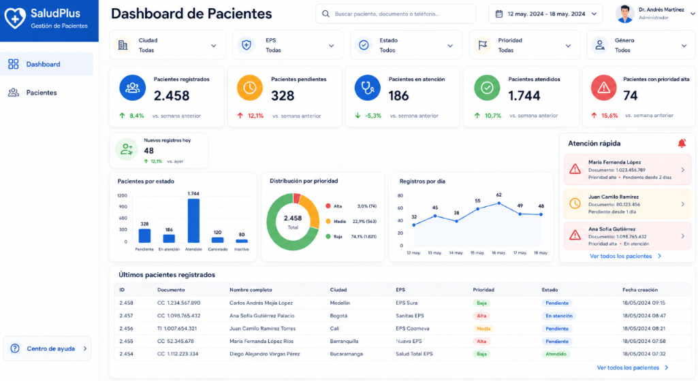
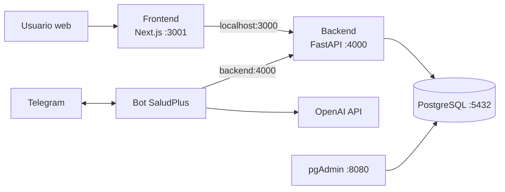
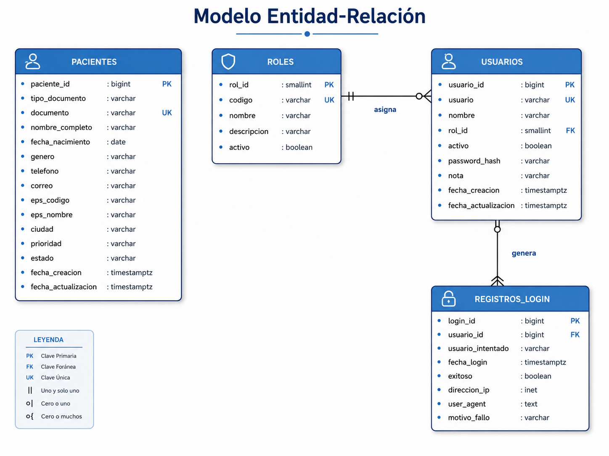
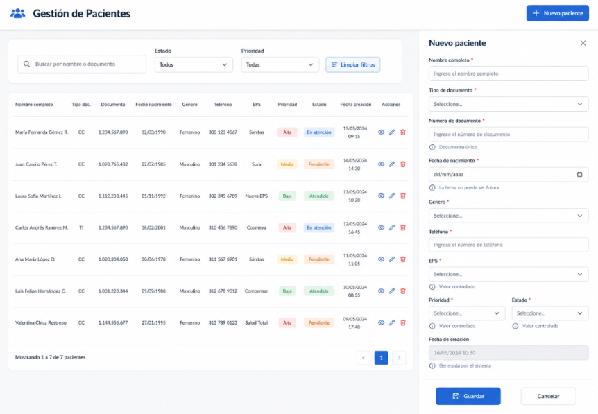
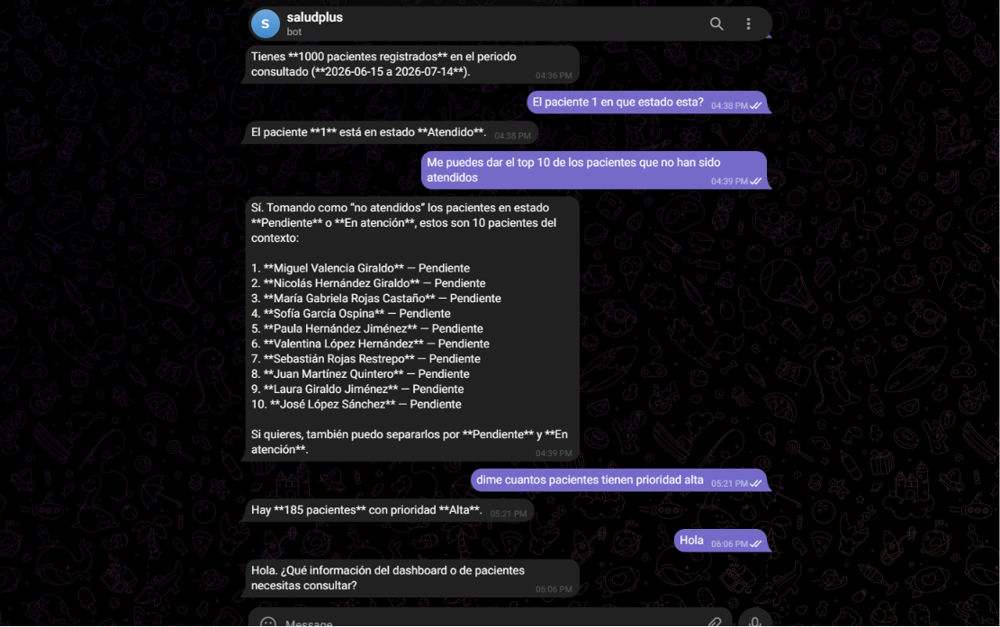
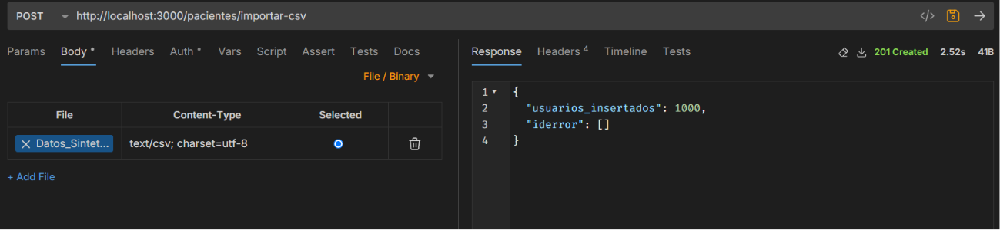

# SaludPlus

Plataforma para administrar pacientes, consultar indicadores y acceder a la
información desde una interfaz web o un bot de Telegram.

Todo el sistema se ejecuta con **Docker Compose**.



## ¿Qué incluye?

- **Frontend:** Next.js, React y Tailwind CSS.
  Incluye login, dashboard y gestión de pacientes.
- **Backend:** FastAPI, SQLAlchemy y JWT.
  Expone la API, aplica las reglas y consulta PostgreSQL.
- **Bot:** Telegram y OpenAI.
  Consulta la API en modo lectura y responde en español.
- **Infraestructura:** PostgreSQL y pgAdmin.
  Ambos se crean y conectan desde `compose.yml`.

## Arquitectura



El navegador consume la API por `http://localhost:3000`.
Dentro de Docker, el bot utiliza `http://backend:4000`.

<details>
<summary><strong>Ver modelo de datos</strong></summary>



</details>

## Inicio rápido

### Requisitos

- Git.
- Docker Desktop o Docker Engine con Compose v2.
- Token de Telegram y API key de OpenAI si se utilizará el bot.

No necesitas instalar Node.js, Python ni PostgreSQL en tu equipo.

### 1. Clonar

```bash
git clone https://github.com/ccgg1997/docker-c.git
cd docker-c
```

### 2. Crear la configuración

PowerShell:

```powershell
Copy-Item .envexample .env
Copy-Item bot/.env.example bot/.env
```

macOS o Linux:

```bash
cp .envexample .env
cp bot/.env.example bot/.env
```

En `.env` cambia como mínimo:

- `POSTGRES_PASSWORD`
- `PGADMIN_DEFAULT_PASSWORD`
- `JWT_SECRET_KEY`

En `bot/.env` completa:

- `BOT_TOKEN`
- `OPENAI_API_KEY`
- `API_USERNAME`
- `API_PASSWORD`

Con los datos demo habilitados puedes usar:

- `API_USERNAME=admin.demo`
- `API_PASSWORD=Demo2026*`

Conserva estas direcciones cuando todo corre en Compose:

```env
NEXT_PUBLIC_API_URL=http://localhost:3000
API_BASE_URL=http://backend:4000
```

`NEXT_PUBLIC_API_URL` puede agregarse al `.env` raíz.
`API_BASE_URL` ya está definida en `bot/.env.example`.

### 3. Levantar todo

```bash
docker compose config --quiet
docker compose up --build -d
docker compose ps
```

El Compose inicia `frontend`, `backend`, `bot`, PostgreSQL y pgAdmin.

Si todavía no configurarás Telegram, inicia solo la aplicación web:

```bash
docker compose up --build -d bd bdcli backend frontend
```

## Accesos locales

- Aplicación: [http://localhost:3001](http://localhost:3001)
- API: [http://localhost:3000](http://localhost:3000)
- Swagger: [http://localhost:3000/docs](http://localhost:3000/docs)
- ReDoc: [http://localhost:3000/redoc](http://localhost:3000/redoc)
- pgAdmin: [http://localhost:8080](http://localhost:8080)
- PostgreSQL: `localhost:5432`

En pgAdmin usa `bd` como host y `5432` como puerto.

## Usuarios demo

Disponibles cuando `SEED_DEMO_DATA=true`:

- Administrador: `admin.demo` / `Demo2026*`
- Operador: `operador.demo` / `Demo2026*`

Si la tabla `pacientes` está vacía, el backend importa automáticamente los
1.000 registros de
[`Datos_Sinteticos_pacientes.csv`](mockups-data/Datos_Sinteticos_pacientes.csv).
Los reinicios posteriores no duplican la información.

Son credenciales exclusivas para desarrollo local.

## Configurar el bot

1. Crea el bot con `@BotFather` y guarda el token en `BOT_TOKEN`.
2. Configura `OPENAI_API_KEY`, `API_USERNAME` y `API_PASSWORD`.
3. Levanta el servicio con `docker compose up --build -d bot`.
4. Envía `/start` en Telegram para conocer el ID del chat.
5. Agrega el ID a `BOT_ALLOWED_CHAT_IDS`.
6. Recrea el contenedor para cargar el cambio:

```bash
docker compose up -d --force-recreate bot
```

Un simple `docker compose restart bot` no vuelve a leer `bot/.env`.

Comandos del bot:

- `/start` — ayuda e ID del chat.
- `/dashboard` — métricas del período.
- `/pacientes` — pacientes recientes.
- `/buscar <texto>` — búsqueda por nombre, documento, ciudad o EPS.
- Mensaje libre — respuesta asistida por OpenAI.

## Recorrido visual

### Gestión de pacientes



### Bot de Telegram



<details>
<summary><strong>Ver importación de 1.000 registros</strong></summary>



</details>

Las capturas y los registros mostrados corresponden a datos sintéticos.

## Estructura

```text
.
├── backend/               API FastAPI y acceso a PostgreSQL
├── bot/                   Bot de Telegram y asistente OpenAI
├── frontend/              Aplicación Next.js
├── mockups-data/          Capturas, modelo ER y datos sintéticos
├── .envexample            Variables del Compose
└── compose.yml            Orquestación de todos los servicios
```

## API principal

- `POST /auth/token` — iniciar sesión.
- `GET /auth/me` — consultar el usuario autenticado.
- `GET /dashboard` — métricas y filtros.
- `/pacientes/` — listar, crear, editar o inactivar pacientes.
- `POST /pacientes/importar-csv` — importar pacientes desde CSV.

Consulta los esquemas en
[http://localhost:3000/docs](http://localhost:3000/docs).

## Comandos útiles

```bash
# Estado y logs
docker compose ps
docker compose logs -f
docker compose logs -f frontend backend bot

# Reconstruir después de cambiar código
docker compose up --build -d

# Detener conservando la base de datos
docker compose down
```

Validación rápida:

```bash
docker compose config --quiet
docker compose build
```

## Problemas frecuentes

**El frontend no conecta con la API**

Comprueba `http://localhost:3000` y reconstruye el frontend si cambiaste
`NEXT_PUBLIC_API_URL`.

**El bot no conecta con el backend**

Dentro de Compose debe usar `API_BASE_URL=http://backend:4000`.

**El bot solo muestra el ID del chat**

Agrega el ID a `BOT_ALLOWED_CHAT_IDS` y recrea el contenedor.

**PostgreSQL conserva las credenciales anteriores**

Las variables de inicialización no modifican un volumen ya creado.

## Más información

- [Frontend](frontend/README.md)
- [Bot](bot/README.md)
- [Docker Compose](https://docs.docker.com/compose/)
- [FastAPI](https://fastapi.tiangolo.com/)
- [Next.js](https://nextjs.org/docs)
